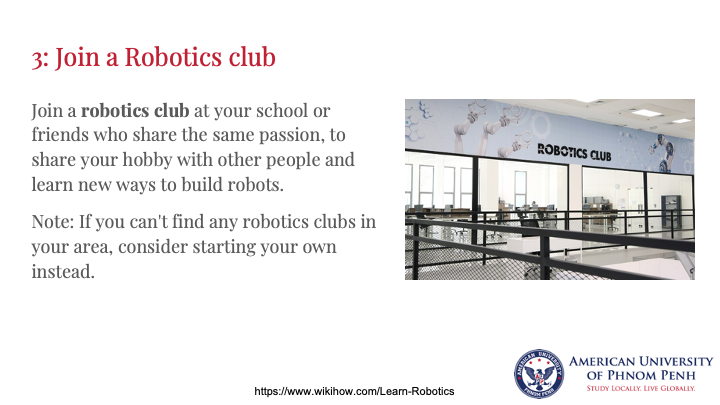

# Introduction to Robotics

In the morning session, participants will be exposed to an overview of the growing Robotics field. 
We will learn more about how the robot is built and its possible applications in the current technology-driven society.

In the afternoon session, we will be able to experience how to program a robot through 
hands-on coding session using an online robotics platform called VEXCode VR. 
After learning, participants will gain the skills to continue to use the platform by themselves.

## Slides
You can download the PDF [Here](./introToRobotics.pdf)

